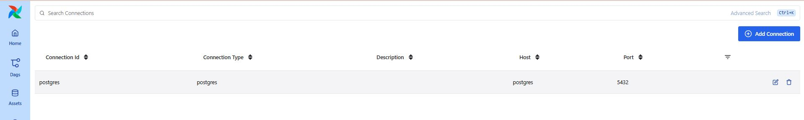
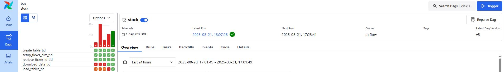

#### Overview of the project   

This is an extension of the project postgres_etl by using Airflow to orchestrate the data pipelines 
The current pipeline performs a full data loading of data

1. Create tables in PostgreSQL 
2. Download datasets using yfinance
- AAPL, SPY, NVDA tickers are downloaded
3. Load the datasets into PostgreSQL 
    - Date dimension 
    - Ticker dimension
    - Stock fact table
4. Airflow to execute the tasks in above order 

Airflow is installed with Docker, https://airflow.apache.org/docs/apache-airflow/3.0.4/docker-compose.yaml

#### Running the pipeline

- Initialise the database
```docker
docker compose up airflow-init
```
- Start the services
```docker
docker compose up -d
```
- Set up PostgreSQL connection on Airflow

- View the DAG runs on Airflow


- To stop the services and delete containers/volume
```docker
docker compose down --volumes --rmi all
```

#### Reference
- https://airflow.apache.org/docs/apache-airflow/stable/howto/docker-compose/index.html