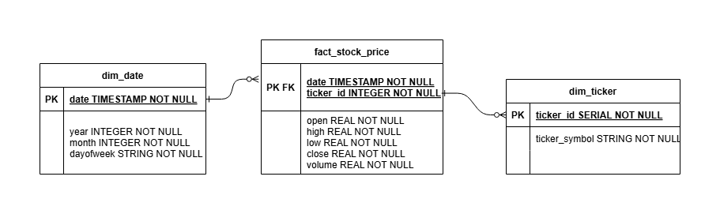

#### Overview of the project   

This project implements an ETL pipeline to download financial stock data, load it into a local PostgreSQL database, and enable incremental data loading.

1. Create Tables in PostgreSQL (create_tables_v1.py)  
- Sets up the fact and dimension tables for storing stock data
2. Download datasets using yfinance(etl.py)
- For illustration purpose, AAPL, SPY, and NVDA tickers are downloaded
- Transforms and loads the data into PostgreSQL 
    - Date dimension table
    - Ticker dimension table
    - Stock fact table
3. Increment data loading (increment_data_loading.py)
- Enables periodic updates without full reloading
    - Create temporary staging tables
    - Retrieve the latest date from the date dimension table (the last watermark)
    - Download dataset from the next date until today
    - Merges the new data into main tables in PostgreSQL 

#### Data Model

A star schema design for storing historical stock price data



#### Environment Setup

To set up the project environment with the required dependencies:

- Create and activate the environment 
    ```bash
    conda env create -f conda.yml
    conda activate postgres_etl
    ```

#### Running the ETL pipeline
- Run the initial table creation
    ```bash 
    python create_tables_v1.py
    ```
- Download and load historical data 
    ```bash 
    python etl.py
    ```
- For increment data updates, run 
    ```bash 
    python increment_data_loading.py
    ```
- To validate the datasets, 
    - Use test_with_modules.ipynb notebook to validate using the imported python modules and check through the tables 

#### Reference
- https://github.com/tommytracey/udacity_data_engineering/tree/master/p1_data_modeling_postgres
